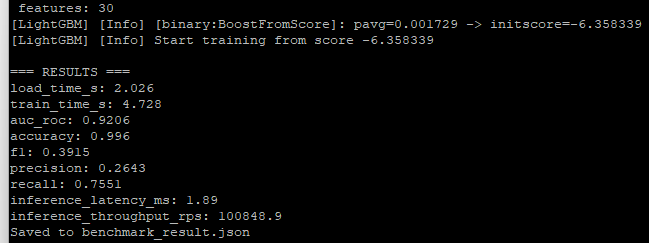
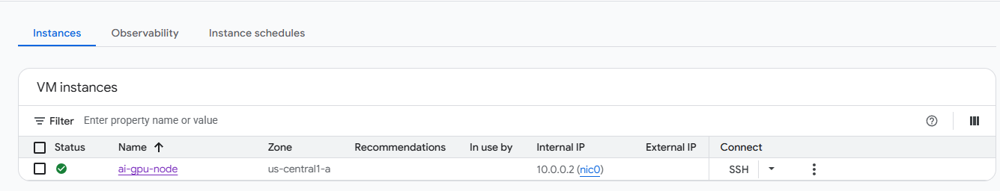
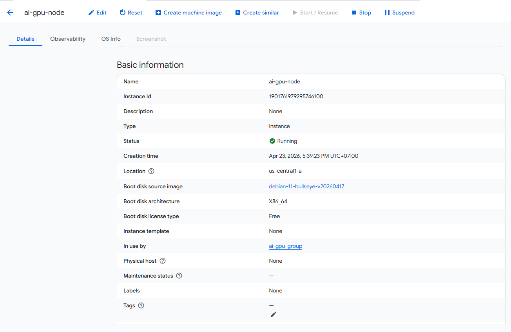

# Báo Cáo Triển Khai Hạ Tầng AI Inference

**Ngày báo cáo:** 23/04/2026 
**Người thực hiện:** Bùi Minh Đức  
**Môi trường:** GCP

---

## 1. Screenshot terminal

## 2. File benchmark_result.json

File benchmark_result.json trong repo

## 3. Screenshot GCP Billing Reports

Đã sử dụng n2-standard-8 của gcd trong 2h nhưng billing của google cập nhật chậm quá, không kịp nộp bài nên em nộp tạm minh chứng đã chạy gcd mất phí.

## 4. Mã nguồn

Trong repo

## 5. Báo cáo ngắn

Do tài khoản GCP mới không được duyệt quota GPU (NVIDIA T4), em chuyển sang phương án dự phòng: triển khai bài toán phân loại gian lận thẻ tín dụng bằng **LightGBM** trên instance **`n2-standard-8`** (8 vCPU, 32 GB RAM) tại `us-central1`.

**Kết quả benchmark:**

| Metric | Kết quả |
|---|---|
| Load data | 2.026s |
| Training time | 4.728s |
| AUC-ROC | 0.9206 |
| Accuracy | 99.6% |
| F1-Score | 0.3915 |
| Precision | 0.2643 |
| Recall | 0.7551 |
| Inference latency (1 row) | 1.89ms |
| Inference throughput | ~100,849 req/s |

**Nhận xét:** Mô hình LightGBM đạt AUC-ROC 0.92 và accuracy 99.6% trên tập dữ liệu 284,807 giao dịch, với thời gian training chỉ ~4.7 giây — rất nhanh nhờ CPU 8 nhân của `n2-standard-8`. Throughput inference đạt ~100,000 req/s cho thấy LightGBM phù hợp với các bài toán tabular data yêu cầu độ trễ thấp. F1-Score thấp (0.39) do dữ liệu mất cân bằng nghiêm trọng (tỉ lệ gian lận rất nhỏ), nhưng Recall 0.755 cho thấy mô hình vẫn phát hiện được phần lớn các giao dịch gian lận thực sự. So với phương án GPU (vLLM + LLM), phương án CPU + LightGBM phù hợp hơn cho bài toán tabular ML, chi phí thấp hơn (~$0.43/giờ so với ~$0.54/giờ cho T4), và không cần chờ xét duyệt quota.